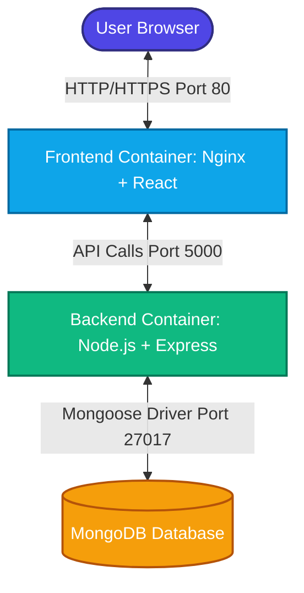

# 🚀 Project Management MERN Stack App: Containerization & Cloud Deployment

Welcome to the ultimate guide for running, containerizing, and deploying this premium **Project Management** MERN stack application. This project has been fully containerized using **Docker** and **Docker Compose**, and is configured with infrastructure-as-code for instant cloud deployment of the backend to **Render**.

---

## 🏗️ System Architecture & Data Flow

This application is split into three main logical services:

1. **Frontend (React + Vite + TailwindCSS)**: Built into lightweight static assets and served using a production-ready **Nginx** reverse proxy web server.
2. **Backend (Node.js + Express.js)**: A RESTful API handling authentication (JWT) and task management, connecting securely to MongoDB.
3. **Database (MongoDB)**: Persists collections for Users, Tasks, and Subtasks.



### 🔒 Dynamic Configuration Highlights
- **Vite API Integration**: The React frontend uses Vite's `import.meta.env.VITE_API_URL` to dynamically direct its API traffic at build-time. This eliminates hardcoded localhost URLs.
- **Configurable CORS**: The Express server implements dynamic CORS handling. It respects the standard localhost port `5173` in development and dynamically extends security permissions to the domain set via the `FRONTEND_URL` environment variable in production.

---

## 🐳 Containerization with Docker

The codebase features robust containerization configuration files engineered for security, caching, and performance:

### 1. Node.js Backend (`backend/Dockerfile`)
Uses the official lightweight `node:20-alpine` image:
* Utilizes Docker layer caching by copying `package.json` and `package-lock.json` and running `npm ci --only=production` before copying source code.
* Exposes port `5000`.

### 2. React Frontend (`client-side/react-project/Dockerfile`)
A **multi-stage build** keeping the final production image under 30MB:
* **Stage 1 (Build)**: Installs devDependencies, passes `VITE_API_URL` as an argument to inject the production backend URL into the bundler, and runs `npm run build` to generate compiled assets.
* **Stage 2 (Production)**: Uses a secure `nginx:alpine` base image. It copies the custom `nginx.conf` (which redirects all non-file route queries back to `index.html` to support React Router history-mode client routing) and mounts the built files directly.

### 3. Multi-Container Orchestration (`docker-compose.yml`)
Binds the services together in a dedicated bridged network (`mern-network`). It configures a named docker volume (`mongo-data`) to persist database collections securely even after stopping and removing containers.

---

## 💻 Running the Project Locally

### Option A: Running with Docker Compose (Recommended)
Once Docker Desktop is active on your system, you can build and run all services simultaneously with a single command:

1. **Start the containers** (automatically downloads images, builds layers, and runs):
   ```bash
   docker compose up --build -d
   ```
2. **Access the Application**:
   * **Frontend**: Open [http://localhost](http://localhost) in your browser.
   * **Backend REST API**: Accessible at [http://localhost:5000](http://localhost:5000).
   * **MongoDB Service**: Locally mapped to port `27017` (connect using MongoDB Compass with `mongodb://127.0.0.1:27017/projectmanagement`).
3. **Stop the containers**:
   ```bash
   docker compose down
   ```

### Option B: Running Manually (Without Docker)
If you cannot run Docker locally, start the components manually:

#### 1. Setup & Run Backend
1. Open a terminal and navigate to `backend`:
   ```bash
   cd backend
   ```
2. Install local dependencies:
   ```bash
   npm install
   ```
3. Set up the `.env` file (configured by default to local MongoDB):
   ```env
   MONGO_URI=mongodb://127.0.0.1:27017/projectmanagement
   JWT_SECRET=your_super_secret_jwt_key_change_me_in_production
   PORT=5000
   ```
4. Start the development server (runs nodemon):
   ```bash
   npm run dev
   ```

#### 2. Setup & Run Frontend
1. Open another terminal and navigate to the React directory:
   ```bash
   cd client-side/react-project
   ```
2. Install frontend dependencies:
   ```bash
   npm install
   ```
3. Start the Vite development server:
   ```bash
   npm run dev
   ```
4. Open [http://localhost:5173](http://localhost:5173) in your browser to interact with the app.

---

## 🛠️ Raw Docker Commands Reference

If you need to build and run the backend and frontend containers manually without Compose, use these standard commands:

### Backend Docker Commands
* **Build backend image**:
  ```bash
  docker build -t mern-backend:1.0 ./backend
  ```
* **Run backend container** (attaches local database network, runs on port 5000):
  ```bash
  docker run -d --name mern-backend-container -p 5000:5000 -e MONGO_URI=mongodb://host.docker.internal:27017/projectmanagement -e JWT_SECRET=mysecretkey mern-backend:1.0
  ```

### Frontend Docker Commands
* **Build frontend image** (injecting local backend API URL at build-time):
  ```bash
  docker build -t mern-frontend:1.0 --build-arg VITE_API_URL=http://localhost:5000 ./client-side/react-project
  ```
* **Run frontend container** (maps port 80 to access via browser):
  ```bash
  docker run -d --name mern-frontend-container -p 80:80 mern-frontend:1.0
  ```

---

## ☁️ Backend Cloud Deployment to Render

We have created an automated **Render Blueprint** (`render.yaml`) in the root directory. Follow these instructions to deploy your backend online.

### Step 1: Create a Free MongoDB Database
Render's filesystem is ephemeral and does not support persistent databases. You must use a cloud database provider like **MongoDB Atlas**:
1. Sign up for a free account at [MongoDB Atlas](https://www.mongodb.com/products/platform/atlas-database).
2. Create a free shared cluster (M0) and choose a region closest to you.
3. Under **Network Access**, add IP address `0.0.0.0/0` to allow connections from Render.
4. Under **Database Access**, create a user with a secure password.
5. Click **Connect** -> **Drivers** and copy the Connection String. It will look like this:
   `mongodb+srv://<username>:<password>@cluster0.xxxxxx.mongodb.net/?retryWrites=true&w=majority&appName=Cluster0`

### Step 2: Push Your Code to GitHub
1. Initialize Git (if not already done) and commit the changes:
   ```bash
   git init
   git add .
   git commit -m "feat: add docker configuration and render blueprint"
   ```
2. Create a new repository on [GitHub](https://github.com).
3. Connect your local directory and push the code:
   ```bash
   git remote add origin https://github.com/<your-username>/<your-repo-name>.git
   git branch -M main
   git push -u origin main
   ```

### Step 3: Deploy to Render Using Blueprints
1. Sign in to your [Render Dashboard](https://dashboard.render.com).
2. Click **New** in the top right, and select **Blueprint**.
3. Link your GitHub repository.
4. Render will read the `render.yaml` file in your repository and display the services to create:
   * **Service Name**: `project-management-backend`
   * **Region**: Select your preferred region.
5. In the **Environment Variables** prompt, paste your MongoDB Atlas Connection String into the `MONGO_URI` field.
6. Click **Apply**. Render will automatically build the backend, generate a secure random `JWT_SECRET`, install the node modules, and boot up the server.

Once deployed, Render will provide you with a **Public URL** for your backend.

### 🔗 Deployed Backend Details
* **Public URL**: `https://project-management-backend-72x9.onrender.com` *(Placeholder: Replace with your actual Render URL after deploying)*
* **Health Check Endpoint**: `https://project-management-backend-72x9.onrender.com/` (Should display: `{"message": "Project Management API is running"}`)

### Connecting Your Local Frontend to Your Deployed Backend
To connect your local development frontend (or a frontend Docker container) directly to the live Render backend, simply add the Render URL when running:

* **Standard Dev Server**:
  On Windows PowerShell:
  ```powershell
  $env:VITE_API_URL="https://project-management-backend-72x9.onrender.com"; npm run dev
  ```
  On Command Prompt:
  ```cmd
  set VITE_API_URL=https://project-management-backend-72x9.onrender.com && npm run dev
  ```

* **With Docker Build**:
  ```bash
  docker build -t mern-frontend:prod --build-arg VITE_API_URL=https://project-management-backend-72x9.onrender.com ./client-side/react-project
  ```
